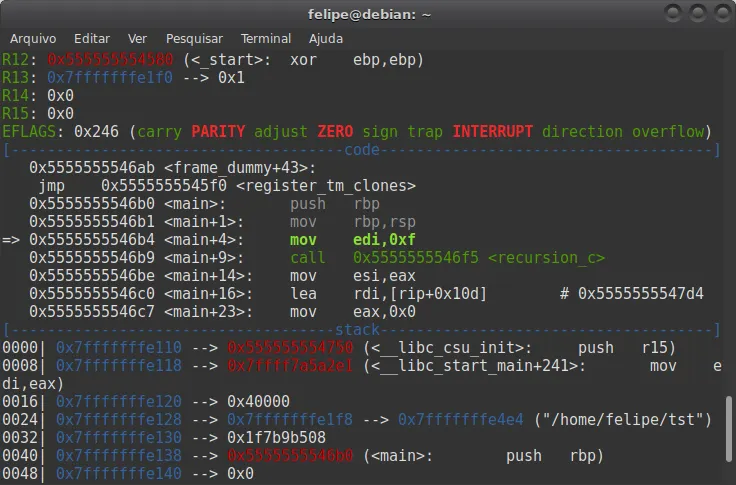

<header> 
 </br>
<h1 align="center"> História da Inteligência Artificial  </h1>
<h1 align="center"> 
<p> Alan Turing </p>


#### Alan Turing foi um matemático, lógico e criptoanalista britânico, considerado o pai da computação e um dos fundadores da inteligência artificial.

# Principais feitos:

#### Máquina de Turing (1936): Criou um modelo abstrato que define os fundamentos lógicos dos computadores modernos. Todo computador hoje é, essencialmente, uma "Máquina de Turing universal".

#### Decifrando o Enigma (1939-1945): Durante a Segunda Guerra, liderou a equipe que quebrou o código da máquina alemã Enigma.<br/>

#### Seu trabalho foi crucial para a vitória dos Aliados, encurtando a guerra e salvando milhões de vidas.Teste de Turing (1950): Propôs um teste para medir a inteligência de uma máquina: se ela pudesse conversar como um humano, seria considerada "inteligente". Essa ideia ainda é debatida hoje no campo da IA.

# Sua vida:

#### Turing era um homem à frente de seu tempo, mas também solitário e excêntrico. Em 1952, foi condenado por homossexualidade e submetido a castração química, o que o levou à depressão. Morreu em 1954, aparentemente por suicídio. Em 2009, o governo britânico pediu desculpas públicas, e em 2013 recebeu perdão real.

# Legado:

#### Sua visão de máquinas que pensam lançou as bases para toda a ciência da computação e para a inteligência artificial que exploramos hoje.

</p>

<h1 align="center"> 
Assembly e as Primeiras Máquinas
 

- Logo após Turing, os computadores eram programados em linguagem de máquina ou assembly. O código era específico para cada máquina.
- Programa em Assembly Simulado
```assembly
; Programa simples: somar dois números
; Estilo PDP-8 assembly

        CLA         ; Limpa acumulador
        TAD A       ; Soma valor de A
        TAD B       ; Soma valor de B
        DCA C       ; Armazena em C
        HLT         ; Para execução

A,      5           ; Dado A
B,      3           ; Dado B
C,      0           ; Resultado
```
</h1>


</h1>
